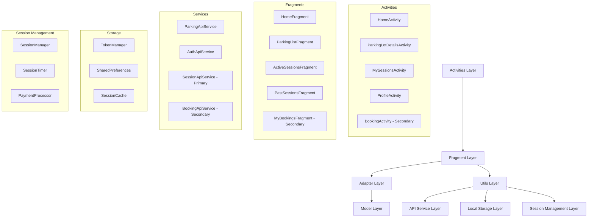

# Design Document

## Overview

The Home Screen with Parking Discovery feature implements a comprehensive parking discovery and real-time session management system for the Vision Parking Android app. The design follows Android best practices using Java, Material Components, and integrates with Google Maps SDK, location services, and REST APIs. The architecture prioritizes the "Park Vehicle" check-in/check-out flow as the primary user journey, with My Sessions management for active and past parking sessions, while supporting booking functionality as a secondary feature.

## Architecture

### High-Level Architecture



### Component Architecture

The application follows a layered architecture with clear separation between UI, business logic, and data layers, with emphasis on real-time session management:

- **Presentation Layer**: Activities and Fragments handling UI interactions
- **Session Management Layer**: Real-time session tracking, timers, and state management
- **Business Logic Layer**: Adapters, Utils, and Service classes
- **Data Layer**: API services, local storage, and session caching

## Components and Interfaces

### Core Activities

#### HomeActivity (PRIMARY)
- **Purpose**: Main container activity with map-based parking discovery
- **Components**: 
  - Hamburger menu icon and app title/logo
  - SearchView/EditText for location search with "Use Current Location" button
  - Full-screen Google Maps SupportMapFragment
  - BottomNavigationView with Home, My Bookings, and Profile
  - Navigation sidebar with user profile and menu items
- **Navigation**: Handles bottom navigation and sidebar menu interactions
- **Dependencies**: TokenManager, LocationManager, SessionManager

#### ParkingLotDetailsActivity (PRIMARY)
- **Purpose**: Display detailed parking information with "Park Now" primary action
- **Components**:
  - Hero image with favorite heart icon
  - Parking lot name, address, and distance display
  - Operating status and hours
  - Availability display with color-coded indicators
  - Pricing information with hourly rates
  - Amenities grid (security, covered parking, EV charging, accessibility)
  - Reviews and rating section
  - Mini map with navigation button
  - **"Park Now" button (PRIMARY ACTION)**
- **Data Flow**: Receives lot ID via Intent, fetches details from API
- **Navigation**: Initiates check-in flow on "Park Now" click

#### MySessionsActivity (PRIMARY)
- **Purpose**: Manage active and past parking sessions
- **Components**:
  - TabLayout with "Active" and "Past" tabs
  - ViewPager2 for tab content
  - Real-time duration tracking for active sessions
  - "Exit Vehicle" button for checkout
  - Session history with payment status
- **Business Logic**: Real-time session monitoring, checkout processing
- **API Integration**: Session management and payment processing

#### ProfileActivity
- **Purpose**: User profile management and settings
- **Components**:
  - User information display
  - Edit profile and logout functionality
- **Functionality**: Profile updates and authentication token management

#### BookingActivity (SECONDARY/FUTURE)
- **Purpose**: Handle advance parking reservations
- **Components**:
  - Date and Time picker dialogs
  - Duration and cost calculation
  - "Confirm Booking" button
- **Priority**: Secondary feature for future implementation

### Key Fragments

#### HomeFragment (PRIMARY)
- **Purpose**: Map-based parking discovery interface
- **Components**:
  - Google Maps integration with colored parking pins
  - Search functionality with location services
  - Pull-to-refresh for real-time updates
- **Map Features**:
  - Color-coded availability pins (Green/Yellow/Red)
  - Current location marker
  - 3km radius parking display
  - Pin click navigation to details

#### ActiveSessionsFragment (PRIMARY)
- **Purpose**: Display and manage current active parking sessions
- **Components**:
  - RecyclerView with active session cards
  - Real-time duration counters
  - "Exit Vehicle" buttons
  - Session details (ID, location, duration)
- **Real-time Features**: Live duration tracking, auto-refresh every 30 seconds

#### PastSessionsFragment (PRIMARY)
- **Purpose**: Display historical parking session records
- **Components**:
  - RecyclerView with past session cards
  - Session details with date/time entries
  - Payment status indicators
  - Duration and cost information
- **Features**: Session history, receipt access, support options

#### ParkingListFragment
- **Purpose**: List view of parking lots with detailed information
- **Components**:
  - RecyclerView with ParkingLotAdapter
  - Card-based layout with availability badges
  - Sorting and filtering options
- **Interaction**: Item click navigation to details screen

#### MyBookingsFragment (SECONDARY)
- **Purpose**: Display advance booking reservations
- **Components**:
  - TabLayout with Upcoming/Past booking tabs
  - Booking cancellation functionality
- **Priority**: Secondary feature for future implementation

### Session Management Components

#### SessionManager (PRIMARY)
```java
public class SessionManager {
    private static SessionManager instance;
    private List<ActiveSession> activeSessions;
    private SessionTimer sessionTimer;
    
    public void startParkingSession(String parkingLotId, ParkingSessionCallback callback) {
        // Create new active session
        // Start real-time tracking
        // Update UI with session details
    }
    
    public void endParkingSession(String sessionId, PaymentCallback callback) {
        // Calculate final amount
        // Process payment
        // Archive session to past
    }
    
    public void updateSessionDuration(String sessionId) {
        // Update real-time duration
        // Calculate current charges
        // Notify UI components
    }
}
```

#### SessionTimer (PRIMARY)
```java
public class SessionTimer {
    private Handler handler;
    private Map<String, Runnable> activeTimers;
    
    public void startTimer(String sessionId, TimerCallback callback) {
        Runnable timerRunnable = new Runnable() {
            @Override
            public void run() {
                // Update duration every second
                // Calculate charges
                // Notify callback
                handler.postDelayed(this, 1000);
            }
        };
        activeTimers.put(sessionId, timerRunnable);
        handler.post(timerRunnable);
    }
    
    public void stopTimer(String sessionId) {
        Runnable timer = activeTimers.remove(sessionId);
        if (timer != null) {
            handler.removeCallbacks(timer);
        }
    }
}
```

### Adapters and ViewHolders

#### ParkingLotAdapter
```java
public class ParkingLotAdapter extends RecyclerView.Adapter<ParkingLotAdapter.ViewHolder> {
    private List<ParkingLot> parkingLots;
    private OnItemClickListener listener;
    
    public static class ViewHolder extends RecyclerView.ViewHolder {
        TextView tvName, tvAddress, tvDistance, tvAvailability;
        View availabilityBadge;
        
        // Bind data with color-coded availability badges
        public void bind(ParkingLot lot) {
            tvName.setText(lot.getName());
            tvAddress.setText(lot.getAddress());
            tvDistance.setText(lot.getFormattedDistance());
            
            // Set availability badge color
            int color = getAvailabilityColor(lot.getAvailabilityStatus());
            availabilityBadge.setBackgroundColor(color);
            tvAvailability.setText(lot.getAvailabilityText());
        }
    }
}
```

#### ActiveSessionAdapter (PRIMARY)
```java
public class ActiveSessionAdapter extends RecyclerView.Adapter<ActiveSessionAdapter.ViewHolder> {
    private List<ActiveSession> activeSessions;
    private SessionActionListener actionListener;
    
    public static class ViewHolder extends RecyclerView.ViewHolder {
        TextView tvParkingLotName, tvAddress, tvSessionId, tvDuration;
        Button btnExitVehicle;
        
        public void bind(ActiveSession session) {
            tvParkingLotName.setText(session.getParkingLotName());
            tvAddress.setText(session.getAddress());
            tvSessionId.setText("ID: #" + session.getSessionId());
            
            // Real-time duration update
            updateDuration(session.getCurrentDuration());
            
            btnExitVehicle.setOnClickListener(v -> 
                actionListener.onExitVehicle(session.getSessionId()));
        }
        
        public void updateDuration(String duration) {
            tvDuration.setText(duration + " Total");
        }
    }
}
```

#### PastSessionAdapter (PRIMARY)
```java
public class PastSessionAdapter extends RecyclerView.Adapter<PastSessionAdapter.ViewHolder> {
    private List<PastSession> pastSessions;
    
    public static class ViewHolder extends RecyclerView.ViewHolder {
        TextView tvParkingLotName, tvAddress, tvSessionId, tvStartTime, tvEndTime, 
                 tvDuration, tvTotalCost, tvPaymentStatus;
        ImageView ivPaymentSuccess;
        
        public void bind(PastSession session) {
            tvParkingLotName.setText(session.getParkingLotName());
            tvAddress.setText(session.getAddress());
            tvSessionId.setText("ID: #" + session.getSessionId());
            tvStartTime.setText("• " + session.getFormattedStartTime());
            tvEndTime.setText("• " + session.getFormattedEndTime());
            tvDuration.setText(session.getFormattedDuration());
            tvTotalCost.setText("Total: " + session.getFormattedCost());
            
            // Payment status indicator
            if (session.isPaymentSuccessful()) {
                tvPaymentStatus.setText("Payment Successful");
                tvPaymentStatus.setTextColor(Color.GREEN);
                ivPaymentSuccess.setVisibility(View.VISIBLE);
            }
        }
    }
}
```

### Google Maps Integration

#### MapFragment Implementation (PRIMARY)
- **Component**: SupportMapFragment embedded in HomeActivity
- **Functionality**:
  - Display parking lots as colored markers within 3km radius
  - Handle marker click events for quick info popup
  - Center map on user location or search results
  - Real-time availability updates every 30 seconds
- **Marker Color Coding**:
  - Green (#4CAF50): Available parking (>5 spots)
  - Yellow (#FFC107): Limited availability (1-5 spots)
  - Red (#F44336): Full parking (0 spots)

#### Location Services
```java
public class LocationManager {
    private FusedLocationProviderClient fusedLocationClient;
    private LocationCallback locationCallback;
    
    public void getCurrentLocation(LocationResultCallback callback) {
        if (hasLocationPermission()) {
            fusedLocationClient.getLastLocation()
                .addOnSuccessListener(location -> {
                    if (location != null) {
                        callback.onLocationReceived(location);
                    } else {
                        requestLocationUpdates(callback);
                    }
                });
        } else {
            requestLocationPermission(callback);
        }
    }
    
    private void requestLocationUpdates(LocationResultCallback callback) {
        LocationRequest locationRequest = LocationRequest.create()
            .setPriority(LocationRequest.PRIORITY_HIGH_ACCURACY)
            .setInterval(10000)
            .setFastestInterval(5000);
            
        fusedLocationClient.requestLocationUpdates(locationRequest, 
            locationCallback, Looper.getMainLooper());
    }
}
```

## Data Models

### Core Data Models

#### ParkingLot Model
```java
public class ParkingLot {
    private String id;
    private String name;
    private String address;
    private double latitude;
    private double longitude;
    private int availableSpots;
    private int totalSpots;
    private double hourlyRate;
    private String operatingHours;
    private boolean isOpen;
    private float averageRating;
    private List<String> amenities;
    private String imageUrl;
    
    public AvailabilityStatus getAvailabilityStatus() {
        if (!isOpen) return AvailabilityStatus.CLOSED;
        if (availableSpots == 0) return AvailabilityStatus.FULL;
        if (availableSpots <= 5) return AvailabilityStatus.LIMITED;
        return AvailabilityStatus.AVAILABLE;
    }
    
    public int getAvailabilityColor() {
        switch (getAvailabilityStatus()) {
            case AVAILABLE: return Color.parseColor("#4CAF50");
            case LIMITED: return Color.parseColor("#FFC107");
            case FULL: return Color.parseColor("#F44336");
            case CLOSED: return Color.parseColor("#9E9E9E");
            default: return Color.parseColor("#9E9E9E");
        }
    }
    
    public String getFormattedDistance(Location userLocation) {
        float[] results = new float[1];
        Location.distanceBetween(userLocation.getLatitude(), userLocation.getLongitude(),
                                latitude, longitude, results);
        float distance = results[0];
        
        if (distance < 1000) {
            return String.format("%.0f m away", distance);
        } else {
            return String.format("%.1f km away", distance / 1000);
        }
    }
}
```

#### ActiveSession Model (PRIMARY)
```java
public class ActiveSession {
    private String sessionId;
    private String parkingLotId;
    private String parkingLotName;
    private String address;
    private Date startTime;
    private double hourlyRate;
    private SessionStatus status;
    
    public String getCurrentDuration() {
        long durationMillis = System.currentTimeMillis() - startTime.getTime();
        long hours = durationMillis / (1000 * 60 * 60);
        long minutes = (durationMillis % (1000 * 60 * 60)) / (1000 * 60);
        
        if (hours > 0) {
            return String.format("%d hrs %d mins", hours, minutes);
        } else {
            return String.format("%d mins", minutes);
        }
    }
    
    public double getCurrentCost() {
        long durationMillis = System.currentTimeMillis() - startTime.getTime();
        double hours = durationMillis / (1000.0 * 60 * 60);
        return Math.ceil(hours) * hourlyRate; // Round up to next hour
    }
    
    public String getFormattedStartTime() {
        SimpleDateFormat sdf = new SimpleDateFormat("dd MMM, yyyy - HH:mm", Locale.getDefault());
        return sdf.format(startTime);
    }
}
```

#### PastSession Model (PRIMARY)
```java
public class PastSession {
    private String sessionId;
    private String parkingLotId;
    private String parkingLotName;
    private String address;
    private Date startTime;
    private Date endTime;
    private double totalCost;
    private boolean paymentSuccessful;
    private String paymentMethod;
    private String receiptUrl;
    
    public String getFormattedDuration() {
        long durationMillis = endTime.getTime() - startTime.getTime();
        long hours = durationMillis / (1000 * 60 * 60);
        long minutes = (durationMillis % (1000 * 60 * 60)) / (1000 * 60);
        
        if (hours > 0) {
            return String.format("%d hrs %d mins", hours, minutes);
        } else {
            return String.format("%d mins", minutes);
        }
    }
    
    public String getFormattedCost() {
        return String.format("₹%.2f", totalCost);
    }
    
    public String getFormattedStartTime() {
        SimpleDateFormat sdf = new SimpleDateFormat("dd MMM, yyyy - HH:mm hrs", Locale.getDefault());
        return sdf.format(startTime);
    }
    
    public String getFormattedEndTime() {
        SimpleDateFormat sdf = new SimpleDateFormat("dd MMM, yyyy - HH:mm hrs", Locale.getDefault());
        return sdf.format(endTime);
    }
}
```

#### Booking Model (SECONDARY)
```java
public class Booking {
    private String bookingId;
    private String parkingLotId;
    private String parkingLotName;
    private Date startTime;
    private Date endTime;
    private double totalCost;
    private BookingStatus status;
    private String qrCode;
    
    public boolean isCancellable() {
        return status == BookingStatus.UPCOMING && 
               startTime.after(new Date(System.currentTimeMillis() + 3600000)); // 1 hour buffer
    }
}
```

### API Response Models

#### ApiResponse Wrapper
```java
public class ApiResponse<T> {
    private boolean success;
    private String message;
    private T data;
    private String errorCode;
    private long timestamp;
}
```

## API Integration

### Networking Architecture

#### Retrofit Configuration
```java
public class ApiClient {
    private static final String BASE_URL = "https://api.visionparking.com/";
    private static Retrofit retrofit;
    
    public static Retrofit getClient() {
        if (retrofit == null) {
            retrofit = new Retrofit.Builder()
                .baseUrl(BASE_URL)
                .addConverterFactory(GsonConverterFactory.create())
                .client(getOkHttpClient())
                .build();
        }
        return retrofit;
    }
    
    private static OkHttpClient getOkHttpClient() {
        return new OkHttpClient.Builder()
            .addInterceptor(new AuthInterceptor())
            .addInterceptor(new LoggingInterceptor())
            .connectTimeout(30, TimeUnit.SECONDS)
            .readTimeout(30, TimeUnit.SECONDS)
            .writeTimeout(30, TimeUnit.SECONDS)
            .build();
    }
}
```

#### API Service Interfaces

##### ParkingApiService
```java
public interface ParkingApiService {
    @GET("parking-lots/nearby")
    Call<ApiResponse<List<ParkingLot>>> getNearbyParkingLots(
        @Query("latitude") double lat,
        @Query("longitude") double lng,
        @Query("radius") int radius // 3000 for 3km
    );
    
    @GET("parking-lots/{id}")
    Call<ApiResponse<ParkingLot>> getParkingLotDetails(@Path("id") String lotId);
    
    @GET("parking-lots/search")
    Call<ApiResponse<List<ParkingLot>>> searchParkingLots(
        @Query("location") String location,
        @Query("radius") int radius
    );
    
    @GET("parking-lots/{id}/availability")
    Call<ApiResponse<AvailabilityInfo>> getRealTimeAvailability(@Path("id") String lotId);
}
```

##### SessionApiService (PRIMARY)
```java
public interface SessionApiService {
    @POST("sessions/start")
    Call<ApiResponse<ActiveSession>> startParkingSession(@Body StartSessionRequest request);
    
    @POST("sessions/{sessionId}/end")
    Call<ApiResponse<PaymentInfo>> endParkingSession(
        @Path("sessionId") String sessionId,
        @Body EndSessionRequest request
    );
    
    @GET("sessions/active")
    Call<ApiResponse<List<ActiveSession>>> getActiveSessions();
    
    @GET("sessions/past")
    Call<ApiResponse<List<PastSession>>> getPastSessions(
        @Query("page") int page,
        @Query("limit") int limit
    );
    
    @GET("sessions/{sessionId}")
    Call<ApiResponse<SessionDetails>> getSessionDetails(@Path("sessionId") String sessionId);
    
    @POST("sessions/{sessionId}/extend")
    Call<ApiResponse<ActiveSession>> extendSession(
        @Path("sessionId") String sessionId,
        @Body ExtendSessionRequest request
    );
}
```

##### BookingApiService (SECONDARY)
```java
public interface BookingApiService {
    @POST("bookings")
    Call<ApiResponse<Booking>> createBooking(@Body BookingRequest request);
    
    @GET("bookings/user")
    Call<ApiResponse<List<Booking>>> getUserBookings(
        @Query("status") String status // "upcoming" or "past"
    );
    
    @DELETE("bookings/{bookingId}")
    Call<ApiResponse<Void>> cancelBooking(@Path("bookingId") String bookingId);
    
    @GET("bookings/{bookingId}")
    Call<ApiResponse<BookingDetails>> getBookingDetails(@Path("bookingId") String bookingId);
}
```

### Repository Pattern Implementation

#### ParkingRepository
```java
public class ParkingRepository {
    private ParkingApiService apiService;
    private LocationManager locationManager;
    private SharedPreferences cache;
    
    public void getNearbyParkingLots(RepositoryCallback<List<ParkingLot>> callback) {
        locationManager.getCurrentLocation(new LocationCallback() {
            @Override
            public void onLocationReceived(Location location) {
                Call<ApiResponse<List<ParkingLot>>> call = apiService.getNearbyParkingLots(
                    location.getLatitude(), 
                    location.getLongitude(), 
                    3000 // 3km radius as per requirements
                );
                
                call.enqueue(new Callback<ApiResponse<List<ParkingLot>>>() {
                    @Override
                    public void onResponse(Call<ApiResponse<List<ParkingLot>>> call, 
                                         Response<ApiResponse<List<ParkingLot>>> response) {
                        if (response.isSuccessful() && response.body().isSuccess()) {
                            List<ParkingLot> lots = response.body().getData();
                            cacheParkingLots(lots); // Cache for offline access
                            callback.onSuccess(lots);
                        } else {
                            callback.onError(response.body().getMessage());
                        }
                    }
                    
                    @Override
                    public void onFailure(Call<ApiResponse<List<ParkingLot>>> call, Throwable t) {
                        // Try to load from cache
                        List<ParkingLot> cachedLots = getCachedParkingLots();
                        if (cachedLots != null && !cachedLots.isEmpty()) {
                            callback.onSuccess(cachedLots);
                        } else {
                            callback.onError("Network error: " + t.getMessage());
                        }
                    }
                });
            }
            
            @Override
            public void onLocationError(String error) {
                callback.onError("Location error: " + error);
            }
        });
    }
}
```

#### SessionRepository (PRIMARY)
```java
public class SessionRepository {
    private SessionApiService apiService;
    private SessionCache sessionCache;
    
    public void startParkingSession(String parkingLotId, RepositoryCallback<ActiveSession> callback) {
        StartSessionRequest request = new StartSessionRequest(parkingLotId, System.currentTimeMillis());
        
        Call<ApiResponse<ActiveSession>> call = apiService.startParkingSession(request);
        call.enqueue(new Callback<ApiResponse<ActiveSession>>() {
            @Override
            public void onResponse(Call<ApiResponse<ActiveSession>> call, 
                                 Response<ApiResponse<ActiveSession>> response) {
                if (response.isSuccessful() && response.body().isSuccess()) {
                    ActiveSession session = response.body().getData();
                    sessionCache.cacheActiveSession(session);
                    callback.onSuccess(session);
                } else {
                    callback.onError(response.body().getMessage());
                }
            }
            
            @Override
            public void onFailure(Call<ApiResponse<ActiveSession>> call, Throwable t) {
                callback.onError("Failed to start session: " + t.getMessage());
            }
        });
    }
    
    public void endParkingSession(String sessionId, RepositoryCallback<PaymentInfo> callback) {
        EndSessionRequest request = new EndSessionRequest(sessionId, System.currentTimeMillis());
        
        Call<ApiResponse<PaymentInfo>> call = apiService.endParkingSession(sessionId, request);
        call.enqueue(new Callback<ApiResponse<PaymentInfo>>() {
            @Override
            public void onResponse(Call<ApiResponse<PaymentInfo>> call, 
                                 Response<ApiResponse<PaymentInfo>> response) {
                if (response.isSuccessful() && response.body().isSuccess()) {
                    PaymentInfo paymentInfo = response.body().getData();
                    sessionCache.removeActiveSession(sessionId);
                    callback.onSuccess(paymentInfo);
                } else {
                    callback.onError(response.body().getMessage());
                }
            }
            
            @Override
            public void onFailure(Call<ApiResponse<PaymentInfo>> call, Throwable t) {
                callback.onError("Failed to end session: " + t.getMessage());
            }
        });
    }
    
    public void getActiveSessions(RepositoryCallback<List<ActiveSession>> callback) {
        // First try to get from cache for immediate display
        List<ActiveSession> cachedSessions = sessionCache.getActiveSessions();
        if (cachedSessions != null && !cachedSessions.isEmpty()) {
            callback.onSuccess(cachedSessions);
        }
        
        // Then fetch from API for real-time updates
        Call<ApiResponse<List<ActiveSession>>> call = apiService.getActiveSessions();
        call.enqueue(new Callback<ApiResponse<List<ActiveSession>>>() {
            @Override
            public void onResponse(Call<ApiResponse<List<ActiveSession>>> call, 
                                 Response<ApiResponse<List<ActiveSession>>> response) {
                if (response.isSuccessful() && response.body().isSuccess()) {
                    List<ActiveSession> sessions = response.body().getData();
                    sessionCache.cacheActiveSessions(sessions);
                    callback.onSuccess(sessions);
                }
            }
            
            @Override
            public void onFailure(Call<ApiResponse<List<ActiveSession>>> call, Throwable t) {
                // If API fails and we don't have cached data, show error
                if (cachedSessions == null || cachedSessions.isEmpty()) {
                    callback.onError("Failed to load active sessions: " + t.getMessage());
                }
            }
        });
    }
}
```

## User Interface Design

### Layout Structure

#### Home Screen Layout (activity_home.xml)
```xml
<androidx.drawerlayout.widget.DrawerLayout
    android:id="@+id/drawerLayout"
    android:layout_width="match_parent"
    android:layout_height="match_parent">
    
    <androidx.coordinatorlayout.widget.CoordinatorLayout
        android:layout_width="match_parent"
        android:layout_height="match_parent">
        
        <LinearLayout
            android:layout_width="match_parent"
            android:layout_height="match_parent"
            android:orientation="vertical">
            
            <!-- Header with hamburger menu and title -->
            <androidx.appcompat.widget.Toolbar
                android:id="@+id/toolbar"
                android:layout_width="match_parent"
                android:layout_height="?attr/actionBarSize"
                android:background="@color/white">
                
                <ImageView
                    android:id="@+id/ivHamburgerMenu"
                    android:layout_width="24dp"
                    android:layout_height="24dp"
                    android:src="@drawable/ic_menu"
                    android:layout_gravity="start" />
                
                <TextView
                    android:layout_width="wrap_content"
                    android:layout_height="wrap_content"
                    android:layout_gravity="center"
                    android:text="Vision Parking"
                    android:textSize="18sp"
                    android:textStyle="bold" />
            </androidx.appcompat.widget.Toolbar>
            
            <!-- Search Section -->
            <LinearLayout
                android:layout_width="match_parent"
                android:layout_height="wrap_content"
                android:orientation="horizontal"
                android:padding="16dp">
                
                <androidx.appcompat.widget.SearchView
                    android:id="@+id/searchView"
                    android:layout_width="0dp"
                    android:layout_height="wrap_content"
                    android:layout_weight="1"
                    android:queryHint="Search location..." />
                
                <Button
                    android:id="@+id/btnCurrentLocation"
                    android:layout_width="wrap_content"
                    android:layout_height="wrap_content"
                    android:layout_marginStart="8dp"
                    android:text="Use Current Location"
                    android:drawableStart="@drawable/ic_location"
                    style="@style/Widget.Material3.Button.OutlinedButton" />
            </LinearLayout>
            
            <!-- Map Container -->
            <FrameLayout
                android:id="@+id/mapContainer"
                android:layout_width="match_parent"
                android:layout_height="0dp"
                android:layout_weight="1" />
        </LinearLayout>
        
        <!-- Bottom Navigation -->
        <com.google.android.material.bottomnavigation.BottomNavigationView
            android:id="@+id/bottomNavigation"
            android:layout_width="match_parent"
            android:layout_height="wrap_content"
            android:layout_gravity="bottom"
            app:menu="@menu/bottom_nav_menu" />
    </androidx.coordinatorlayout.widget.CoordinatorLayout>
    
    <!-- Navigation Sidebar -->
    <com.google.android.material.navigation.NavigationView
        android:id="@+id/navigationView"
        android:layout_width="wrap_content"
        android:layout_height="match_parent"
        android:layout_gravity="start"
        app:headerLayout="@layout/nav_header"
        app:menu="@menu/drawer_menu" />
</androidx.drawerlayout.widget.DrawerLayout>
```

#### My Sessions Layout (activity_my_sessions.xml)
```xml
<LinearLayout
    android:layout_width="match_parent"
    android:layout_height="match_parent"
    android:orientation="vertical">
    
    <!-- Header -->
    <androidx.appcompat.widget.Toolbar
        android:id="@+id/toolbar"
        android:layout_width="match_parent"
        android:layout_height="?attr/actionBarSize"
        android:background="@color/white">
        
        <ImageView
            android:id="@+id/ivBack"
            android:layout_width="24dp"
            android:layout_height="24dp"
            android:src="@drawable/ic_arrow_back"
            android:layout_gravity="start" />
        
        <TextView
            android:layout_width="wrap_content"
            android:layout_height="wrap_content"
            android:layout_gravity="center"
            android:text="My Sessions"
            android:textSize="20sp"
            android:textStyle="bold" />
    </androidx.appcompat.widget.Toolbar>
    
    <!-- Tab Layout -->
    <com.google.android.material.tabs.TabLayout
        android:id="@+id/tabLayout"
        android:layout_width="match_parent"
        android:layout_height="48dp"
        android:background="@color/white"
        app:tabIndicatorColor="@color/green_primary"
        app:tabSelectedTextColor="@color/green_primary"
        app:tabTextColor="@color/gray_medium" />
    
    <!-- ViewPager for tab content -->
    <androidx.viewpager2.widget.ViewPager2
        android:id="@+id/viewPager"
        android:layout_width="match_parent"
        android:layout_height="0dp"
        android:layout_weight="1"
        android:background="@color/gray_light" />
</LinearLayout>
```

#### Active Session Item Layout (item_active_session.xml)
```xml
<androidx.cardview.widget.CardView
    android:layout_width="match_parent"
    android:layout_height="wrap_content"
    android:layout_margin="16dp"
    app:cardCornerRadius="8dp"
    app:cardElevation="2dp">
    
    <LinearLayout
        android:layout_width="match_parent"
        android:layout_height="wrap_content"
        android:orientation="vertical"
        android:padding="16dp">
        
        <!-- Location Info -->
        <LinearLayout
            android:layout_width="match_parent"
            android:layout_height="wrap_content"
            android:orientation="horizontal">
            
            <LinearLayout
                android:layout_width="0dp"
                android:layout_height="wrap_content"
                android:layout_weight="1"
                android:orientation="vertical">
                
                <TextView
                    android:id="@+id/tvParkingLotName"
                    android:layout_width="wrap_content"
                    android:layout_height="wrap_content"
                    android:text="Stuttgart, Stephangarage"
                    android:textSize="16sp"
                    android:textStyle="bold"
                    android:textColor="@color/text_primary" />
                
                <TextView
                    android:id="@+id/tvAddress"
                    android:layout_width="wrap_content"
                    android:layout_height="wrap_content"
                    android:text="kronenstraße"
                    android:textSize="14sp"
                    android:textColor="@color/text_secondary" />
            </LinearLayout>
            
            <ImageView
                android:layout_width="20dp"
                android:layout_height="20dp"
                android:src="@drawable/ic_chevron_right"
                android:layout_gravity="center_vertical" />
        </LinearLayout>
        
        <!-- Session Details -->
        <TextView
            android:id="@+id/tvSessionId"
            android:layout_width="wrap_content"
            android:layout_height="wrap_content"
            android:layout_marginTop="8dp"
            android:text="ID: #11235532232"
            android:textSize="14sp"
            android:textColor="@color/text_secondary" />
        
        <LinearLayout
            android:layout_width="match_parent"
            android:layout_height="wrap_content"
            android:layout_marginTop="4dp"
            android:orientation="horizontal"
            android:gravity="center_vertical">
            
            <ImageView
                android:layout_width="16dp"
                android:layout_height="16dp"
                android:src="@drawable/ic_clock"
                android:layout_marginEnd="4dp" />
            
            <TextView
                android:id="@+id/tvCurrentDuration"
                android:layout_width="wrap_content"
                android:layout_height="wrap_content"
                android:text="47 mins, 20:10 - 16:00 hrs"
                android:textSize="14sp"
                android:textColor="@color/text_secondary" />
            
            <View
                android:layout_width="4dp"
                android:layout_height="4dp"
                android:layout_marginHorizontal="8dp"
                android:background="@drawable/circle_dot"
                android:backgroundTint="@color/text_secondary" />
        </LinearLayout>
        
        <TextView
            android:id="@+id/tvTotalDuration"
            android:layout_width="wrap_content"
            android:layout_height="wrap_content"
            android:layout_marginTop="4dp"
            android:text="47 mins Total"
            android:textSize="16sp"
            android:textColor="@color/text_primary" />
        
        <!-- Exit Vehicle Button -->
        <Button
            android:id="@+id/btnExitVehicle"
            android:layout_width="wrap_content"
            android:layout_height="wrap_content"
            android:layout_gravity="end"
            android:layout_marginTop="12dp"
            android:text="Exit Vehicle"
            android:textColor="@color/white"
            android:backgroundTint="@color/green_primary"
            style="@style/Widget.Material3.Button" />
    </LinearLayout>
</androidx.cardview.widget.CardView>
```

#### Past Session Item Layout (item_past_session.xml)
```xml
<androidx.cardview.widget.CardView
    android:layout_width="match_parent"
    android:layout_height="wrap_content"
    android:layout_margin="16dp"
    app:cardCornerRadius="8dp"
    app:cardElevation="2dp">
    
    <LinearLayout
        android:layout_width="match_parent"
        android:layout_height="wrap_content"
        android:orientation="vertical"
        android:padding="16dp">
        
        <!-- Location Info with Menu -->
        <LinearLayout
            android:layout_width="match_parent"
            android:layout_height="wrap_content"
            android:orientation="horizontal">
            
            <LinearLayout
                android:layout_width="0dp"
                android:layout_height="wrap_content"
                android:layout_weight="1"
                android:orientation="vertical">
                
                <TextView
                    android:id="@+id/tvParkingLotName"
                    android:layout_width="wrap_content"
                    android:layout_height="wrap_content"
                    android:text="Stuttgart, Am Schlossplatz"
                    android:textSize="16sp"
                    android:textStyle="bold"
                    android:textColor="@color/text_primary" />
                
                <TextView
                    android:id="@+id/tvAddress"
                    android:layout_width="wrap_content"
                    android:layout_height="wrap_content"
                    android:text="Stauffenbergstrasse"
                    android:textSize="14sp"
                    android:textColor="@color/text_secondary" />
            </LinearLayout>
            
            <ImageView
                android:layout_width="20dp"
                android:layout_height="20dp"
                android:src="@drawable/ic_chevron_right"
                android:layout_gravity="center_vertical"
                android:layout_marginEnd="8dp" />
            
            <ImageView
                android:id="@+id/ivMenu"
                android:layout_width="20dp"
                android:layout_height="20dp"
                android:src="@drawable/ic_more_vert"
                android:layout_gravity="center_vertical" />
        </LinearLayout>
        
        <!-- Session Details -->
        <TextView
            android:id="@+id/tvSessionId"
            android:layout_width="wrap_content"
            android:layout_height="wrap_content"
            android:layout_marginTop="8dp"
            android:text="ID: #11235532232"
            android:textSize="14sp"
            android:textColor="@color/text_secondary" />
        
        <!-- Date/Time Entries -->
        <TextView
            android:id="@+id/tvStartTime"
            android:layout_width="wrap_content"
            android:layout_height="wrap_content"
            android:layout_marginTop="4dp"
            android:text="• 13th Feb, 2018 - 16:00 hrs"
            android:textSize="14sp"
            android:textColor="@color/text_secondary" />
        
        <TextView
            android:id="@+id/tvEndTime"
            android:layout_width="wrap_content"
            android:layout_height="wrap_content"
            android:text="• 13th Feb, 2018 - 18:40 hrs"
            android:textSize="14sp"
            android:textColor="@color/text_secondary" />
        
        <!-- Duration -->
        <LinearLayout
            android:layout_width="match_parent"
            android:layout_height="wrap_content"
            android:layout_marginTop="4dp"
            android:orientation="horizontal"
            android:gravity="center_vertical">
            
            <ImageView
                android:layout_width="16dp"
                android:layout_height="16dp"
                android:src="@drawable/ic_clock"
                android:layout_marginEnd="4dp" />
            
            <TextView
                android:id="@+id/tvDuration"
                android:layout_width="wrap_content"
                android:layout_height="wrap_content"
                android:text="2 hrs 40 mins"
                android:textSize="14sp"
                android:textColor="@color/text_secondary" />
        </LinearLayout>
        
        <!-- Payment Info -->
        <LinearLayout
            android:layout_width="match_parent"
            android:layout_height="wrap_content"
            android:layout_marginTop="8dp"
            android:orientation="horizontal">
            
            <TextView
                android:id="@+id/tvTotalCost"
                android:layout_width="0dp"
                android:layout_height="wrap_content"
                android:layout_weight="1"
                android:text="Total: €5"
                android:textSize="14sp"
                android:textColor="@color/text_primary" />
            
            <LinearLayout
                android:layout_width="wrap_content"
                android:layout_height="wrap_content"
                android:orientation="horizontal"
                android:gravity="center_vertical">
                
                <TextView
                    android:id="@+id/tvPaymentStatus"
                    android:layout_width="wrap_content"
                    android:layout_height="wrap_content"
                    android:text="Payment Successful"
                    android:textSize="14sp"
                    android:textColor="@color/green_primary" />
                
                <ImageView
                    android:id="@+id/ivPaymentSuccess"
                    android:layout_width="16dp"
                    android:layout_height="16dp"
                    android:layout_marginStart="4dp"
                    android:src="@drawable/ic_check_circle"
                    android:tint="@color/green_primary" />
            </LinearLayout>
        </LinearLayout>
    </LinearLayout>
</androidx.cardview.widget.CardView>
```

### Navigation Flow Implementation

#### Bottom Navigation Setup
```java
public class HomeActivity extends AppCompatActivity {
    private BottomNavigationView bottomNavigation;
    private DrawerLayout drawerLayout;
    private NavigationView navigationView;
    
    private void setupBottomNavigation() {
        bottomNavigation.setOnItemSelectedListener(item -> {
            switch (item.getItemId()) {
                case R.id.nav_home:
                    // Already on home
                    return true;
                case R.id.nav_bookings:
                    startActivity(new Intent(this, MySessionsActivity.class));
                    return true;
                case R.id.nav_profile:
                    startActivity(new Intent(this, ProfileActivity.class));
                    return true;
            }
            return false;
        });
    }
    
    private void setupNavigationDrawer() {
        navigationView.setNavigationItemSelectedListener(item -> {
            switch (item.getItemId()) {
                case R.id.nav_home:
                    drawerLayout.closeDrawers();
                    return true;
                case R.id.nav_my_bookings:
                    startActivity(new Intent(this, MySessionsActivity.class));
                    break;
                case R.id.nav_active_sessions:
                    Intent intent = new Intent(this, MySessionsActivity.class);
                    intent.putExtra("default_tab", 0); // Active tab
                    startActivity(intent);
                    break;
                case R.id.nav_past_sessions:
                    Intent intent2 = new Intent(this, MySessionsActivity.class);
                    intent2.putExtra("default_tab", 1); // Past tab
                    startActivity(intent2);
                    break;
                case R.id.nav_logout:
                    handleLogout();
                    break;
            }
            drawerLayout.closeDrawers();
            return true;
        });
    }
}
```

## Error Handling

### Comprehensive Error Handling Strategy

#### Network Error Handling
```java
public class ErrorHandler {
    public static void handleApiError(Context context, Throwable error, ErrorCallback callback) {
        String message;
        boolean isRetryable = false;
        
        if (error instanceof IOException) {
            message = "Network connection error. Please check your internet connection.";
            isRetryable = true;
        } else if (error instanceof HttpException) {
            HttpException httpError = (HttpException) error;
            message = getHttpErrorMessage(httpError.code());
            isRetryable = httpError.code() >= 500; // Server errors are retryable
        } else if (error instanceof SocketTimeoutException) {
            message = "Request timed out. Please try again.";
            isRetryable = true;
        } else {
            message = "An unexpected error occurred. Please try again.";
            isRetryable = true;
        }
        
        if (callback != null) {
            callback.onError(message, isRetryable);
        } else {
            showErrorDialog(context, message, isRetryable);
        }
    }
    
    private static String getHttpErrorMessage(int code) {
        switch (code) {
            case 401: return "Authentication failed. Please login again.";
            case 403: return "Access denied. Please check your permissions.";
            case 404: return "Requested resource not found.";
            case 409: return "Parking session conflict. Please refresh and try again.";
            case 422: return "Invalid request data. Please check your input.";
            case 500: return "Server error. Please try again later.";
            case 503: return "Service temporarily unavailable. Please try again later.";
            default: return "Request failed (Error " + code + "). Please try again.";
        }
    }
    
    private static void showErrorDialog(Context context, String message, boolean isRetryable) {
        AlertDialog.Builder builder = new AlertDialog.Builder(context)
            .setTitle("Error")
            .setMessage(message)
            .setPositiveButton("OK", null);
            
        if (isRetryable) {
            builder.setNeutralButton("Retry", (dialog, which) -> {
                // Trigger retry mechanism
                if (context instanceof RetryableActivity) {
                    ((RetryableActivity) context).onRetryRequested();
                }
            });
        }
        
        builder.show();
    }
}
```

#### Session Management Error Handling
```java
public class SessionErrorHandler {
    public static void handleSessionError(Context context, String sessionId, Throwable error) {
        if (error instanceof SessionConflictException) {
            showSessionConflictDialog(context, sessionId);
        } else if (error instanceof PaymentFailedException) {
            showPaymentFailedDialog(context, sessionId);
        } else if (error instanceof SessionExpiredException) {
            showSessionExpiredDialog(context, sessionId);
        } else {
            ErrorHandler.handleApiError(context, error, null);
        }
    }
    
    private static void showSessionConflictDialog(Context context, String sessionId) {
        new AlertDialog.Builder(context)
            .setTitle("Session Conflict")
            .setMessage("Another session is already active for this parking lot. Please end the existing session first.")
            .setPositiveButton("View Active Sessions", (dialog, which) -> {
                Intent intent = new Intent(context, MySessionsActivity.class);
                intent.putExtra("default_tab", 0); // Active tab
                context.startActivity(intent);
            })
            .setNegativeButton("Cancel", null)
            .show();
    }
    
    private static void showPaymentFailedDialog(Context context, String sessionId) {
        new AlertDialog.Builder(context)
            .setTitle("Payment Failed")
            .setMessage("Payment processing failed. Your session has been saved and you can retry payment from My Sessions.")
            .setPositiveButton("Retry Payment", (dialog, which) -> {
                // Navigate to payment retry screen
                Intent intent = new Intent(context, PaymentActivity.class);
                intent.putExtra("session_id", sessionId);
                intent.putExtra("retry_mode", true);
                context.startActivity(intent);
            })
            .setNegativeButton("Later", null)
            .show();
    }
}
```

#### Location Permission Handling
```java
public class LocationPermissionHandler {
    private static final int LOCATION_PERMISSION_REQUEST_CODE = 1001;
    
    public void requestLocationPermission(Activity activity, PermissionCallback callback) {
        if (ContextCompat.checkSelfPermission(activity, Manifest.permission.ACCESS_FINE_LOCATION) 
            != PackageManager.PERMISSION_GRANTED) {
            
            if (ActivityCompat.shouldShowRequestPermissionRationale(activity, 
                Manifest.permission.ACCESS_FINE_LOCATION)) {
                showPermissionRationale(activity, callback);
            } else {
                ActivityCompat.requestPermissions(activity, 
                    new String[]{Manifest.permission.ACCESS_FINE_LOCATION}, 
                    LOCATION_PERMISSION_REQUEST_CODE);
            }
        } else {
            callback.onPermissionGranted();
        }
    }
    
    private void showPermissionRationale(Activity activity, PermissionCallback callback) {
        new AlertDialog.Builder(activity)
            .setTitle("Location Permission Required")
            .setMessage("This app needs location access to find nearby parking lots and provide accurate directions.")
            .setPositiveButton("Grant Permission", (dialog, which) -> {
                ActivityCompat.requestPermissions(activity, 
                    new String[]{Manifest.permission.ACCESS_FINE_LOCATION}, 
                    LOCATION_PERMISSION_REQUEST_CODE);
            })
            .setNegativeButton("Cancel", (dialog, which) -> {
                callback.onPermissionDenied();
            })
            .show();
    }
}
```

## Testing Strategy

### Unit Testing Approach

#### Model Testing
```java
@RunWith(JUnit4.class)
public class ActiveSessionTest {
    
    @Test
    public void testGetCurrentDuration_ReturnsCorrectFormat() {
        // Given
        Date startTime = new Date(System.currentTimeMillis() - (2 * 60 * 60 * 1000 + 30 * 60 * 1000)); // 2.5 hours ago
        ActiveSession session = new ActiveSession("123", "lot1", "Test Lot", "Test Address", startTime, 10.0);
        
        // When
        String duration = session.getCurrentDuration();
        
        // Then
        assertEquals("2 hrs 30 mins", duration);
    }
    
    @Test
    public void testGetCurrentCost_CalculatesCorrectly() {
        // Given
        Date startTime = new Date(System.currentTimeMillis() - (90 * 60 * 1000)); // 1.5 hours ago
        ActiveSession session = new ActiveSession("123", "lot1", "Test Lot", "Test Address", startTime, 10.0);
        
        // When
        double cost = session.getCurrentCost();
        
        // Then
        assertEquals(20.0, cost, 0.01); // Should round up to 2 hours
    }
    
    @Test
    public void testAvailabilityStatus_ReturnsCorrectStatus() {
        // Given
        ParkingLot lot = new ParkingLot();
        lot.setAvailableSpots(3);
        lot.setOpen(true);
        
        // When
        AvailabilityStatus status = lot.getAvailabilityStatus();
        
        // Then
        assertEquals(AvailabilityStatus.LIMITED, status);
    }
}
```

#### Repository Testing
```java
@RunWith(MockitoJUnitRunner.class)
public class SessionRepositoryTest {
    
    @Mock
    private SessionApiService apiService;
    
    @Mock
    private SessionCache sessionCache;
    
    @InjectMocks
    private SessionRepository repository;
    
    @Test
    public void testStartParkingSession_Success() {
        // Given
        String parkingLotId = "lot123";
        ActiveSession expectedSession = new ActiveSession("session123", parkingLotId, "Test Lot", "Test Address", new Date(), 10.0);
        ApiResponse<ActiveSession> response = new ApiResponse<>(true, "Success", expectedSession, null);
        
        when(apiService.startParkingSession(any(StartSessionRequest.class)))
            .thenReturn(createSuccessCall(response));
        
        // When
        repository.startParkingSession(parkingLotId, new RepositoryCallback<ActiveSession>() {
            @Override
            public void onSuccess(ActiveSession session) {
                // Then
                assertEquals("session123", session.getSessionId());
                assertEquals(parkingLotId, session.getParkingLotId());
                verify(sessionCache).cacheActiveSession(session);
            }
            
            @Override
            public void onError(String error) {
                fail("Should not call onError");
            }
        });
    }
    
    @Test
    public void testGetActiveSessions_UsesCache() {
        // Given
        List<ActiveSession> cachedSessions = Arrays.asList(
            new ActiveSession("session1", "lot1", "Lot 1", "Address 1", new Date(), 10.0)
        );
        when(sessionCache.getActiveSessions()).thenReturn(cachedSessions);
        
        // When
        repository.getActiveSessions(new RepositoryCallback<List<ActiveSession>>() {
            @Override
            public void onSuccess(List<ActiveSession> sessions) {
                // Then
                assertEquals(1, sessions.size());
                assertEquals("session1", sessions.get(0).getSessionId());
            }
            
            @Override
            public void onError(String error) {
                fail("Should not call onError");
            }
        });
        
        // Verify cache was checked first
        verify(sessionCache).getActiveSessions();
    }
}
```

#### Session Manager Testing
```java
@RunWith(MockitoJUnitRunner.class)
public class SessionManagerTest {
    
    @Mock
    private SessionRepository repository;
    
    @Mock
    private SessionTimer sessionTimer;
    
    @InjectMocks
    private SessionManager sessionManager;
    
    @Test
    public void testStartParkingSession_StartsTimer() {
        // Given
        String parkingLotId = "lot123";
        ActiveSession session = new ActiveSession("session123", parkingLotId, "Test Lot", "Test Address", new Date(), 10.0);
        
        doAnswer(invocation -> {
            RepositoryCallback<ActiveSession> callback = invocation.getArgument(1);
            callback.onSuccess(session);
            return null;
        }).when(repository).startParkingSession(eq(parkingLotId), any(RepositoryCallback.class));
        
        // When
        sessionManager.startParkingSession(parkingLotId, new ParkingSessionCallback() {
            @Override
            public void onSessionStarted(ActiveSession activeSession) {
                // Then
                assertEquals("session123", activeSession.getSessionId());
                verify(sessionTimer).startTimer(eq("session123"), any(TimerCallback.class));
            }
            
            @Override
            public void onError(String error) {
                fail("Should not call onError");
            }
        });
    }
}
```

### Integration Testing

#### API Integration Testing
```java
@RunWith(AndroidJUnit4.class)
public class ParkingApiIntegrationTest {
    
    private ParkingApiService apiService;
    
    @Before
    public void setUp() {
        apiService = ApiClient.getClient().create(ParkingApiService.class);
    }
    
    @Test
    public void testGetNearbyParkingLots_ReturnsValidData() throws IOException {
        // Given
        double latitude = 37.7749;
        double longitude = -122.4194;
        int radius = 3000;
        
        // When
        Response<ApiResponse<List<ParkingLot>>> response = apiService
            .getNearbyParkingLots(latitude, longitude, radius)
            .execute();
        
        // Then
        assertTrue(response.isSuccessful());
        assertNotNull(response.body());
        assertTrue(response.body().isSuccess());
        assertNotNull(response.body().getData());
        assertFalse(response.body().getData().isEmpty());
        
        // Verify data structure
        ParkingLot firstLot = response.body().getData().get(0);
        assertNotNull(firstLot.getId());
        assertNotNull(firstLot.getName());
        assertNotNull(firstLot.getAddress());
        assertTrue(firstLot.getLatitude() != 0);
        assertTrue(firstLot.getLongitude() != 0);
    }
    
    @Test
    public void testStartParkingSession_CreatesActiveSession() throws IOException {
        // Given
        StartSessionRequest request = new StartSessionRequest("test_lot_123", System.currentTimeMillis());
        
        // When
        Response<ApiResponse<ActiveSession>> response = ApiClient.getClient()
            .create(SessionApiService.class)
            .startParkingSession(request)
            .execute();
        
        // Then
        assertTrue(response.isSuccessful());
        assertNotNull(response.body());
        assertTrue(response.body().isSuccess());
        
        ActiveSession session = response.body().getData();
        assertNotNull(session.getSessionId());
        assertEquals("test_lot_123", session.getParkingLotId());
        assertNotNull(session.getStartTime());
    }
}
```

#### UI Integration Testing
```java
@RunWith(AndroidJUnit4.class)
@LargeTest
public class HomeActivityIntegrationTest {
    
    @Rule
    public ActivityTestRule<HomeActivity> activityRule = new ActivityTestRule<>(HomeActivity.class);
    
    @Test
    public void testMapDisplaysParkingLots() {
        // Wait for map to load
        onView(withId(R.id.mapContainer))
            .check(matches(isDisplayed()));
        
        // Wait for parking lots to load
        SystemClock.sleep(3000);
        
        // Verify map markers are displayed
        // Note: This would require custom map testing utilities
        // to verify marker presence and colors
    }
    
    @Test
    public void testBottomNavigationWorks() {
        // Test My Bookings navigation
        onView(withId(R.id.nav_bookings))
            .perform(click());
        
        // Verify navigation to My Sessions activity
        intended(hasComponent(MySessionsActivity.class.getName()));
    }
    
    @Test
    public void testSearchFunctionality() {
        // Enter search query
        onView(withId(R.id.searchView))
            .perform(click())
            .perform(typeText("Central Mall"));
        
        // Verify search results are displayed
        // This would require mocking the API response
        SystemClock.sleep(2000);
        
        // Verify map updates with search results
        // Custom verification logic for map state
    }
}
```

### End-to-End Testing Strategy

The existing Appium test framework should be extended to cover the primary "Park Vehicle" flow:

#### Primary Flow E2E Tests
1. **Complete Park Vehicle Flow**:
   - Login → Home Screen → Search Location → Select Parking → Park Now → Active Session
   
2. **Session Management Flow**:
   - Active Session → Real-time Updates → Exit Vehicle → Payment → Past Session
   
3. **Error Scenarios**:
   - Network failures during session start/end
   - Payment failures and retry mechanisms
   - Location permission handling

#### Secondary Flow E2E Tests (Future)
1. **Booking Flow**: Search → Details → Book Slot → Confirmation → My Bookings
2. **Profile Management**: Login → Profile → Edit → Save → Logout

## Performance Considerations

### Memory Management
- Implement proper ViewHolder pattern in all RecyclerViews
- Use efficient image loading with Glide for parking lot images
- Implement proper lifecycle management for API calls and timers
- Cache session data locally to reduce API calls
- Use weak references for callback interfaces to prevent memory leaks

### Network Optimization
- Implement request caching for frequently accessed parking lot data
- Use appropriate timeout values (30s for session operations, 10s for availability updates)
- Implement exponential backoff retry logic for failed requests
- Batch API requests where possible (e.g., multiple parking lot details)
- Use compression for API responses

### Battery Optimization
- Use efficient location update strategies (balanced power accuracy)
- Implement proper background task management for session timers
- Optimize map rendering and marker updates
- Use JobScheduler for background session synchronization
- Implement doze mode compatibility for active session tracking

### Real-time Updates Optimization
- Use WebSocket connections for real-time session updates (future enhancement)
- Implement efficient polling intervals (30 seconds for availability, 1 second for active session duration)
- Use local caching to minimize API calls during rapid UI updates
- Implement smart refresh strategies based on user activity

This design document provides a comprehensive foundation for implementing the Home Screen with Parking Discovery feature, prioritizing the "Park Vehicle" check-in/check-out flow while maintaining support for future booking functionality. The architecture supports real-time session management, efficient API integration, and a user-friendly interface that follows Android best practices.