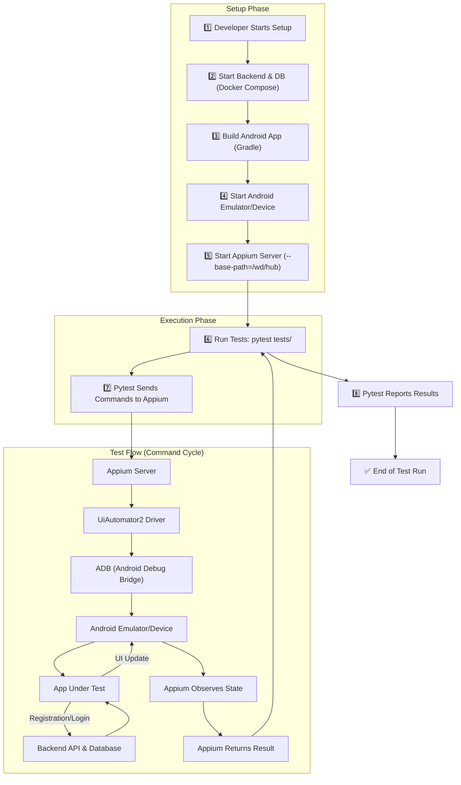
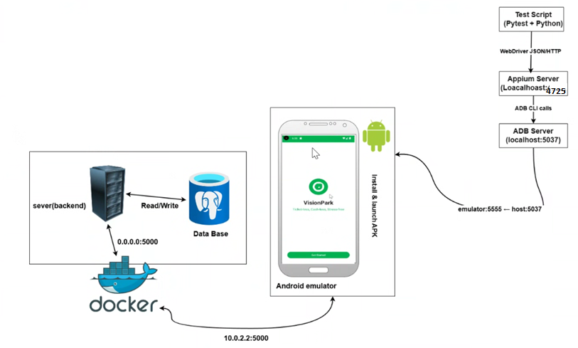

# Test Plan – VisionPark App

## Overview
This test plan outlines the End-to-End (E2E)/Integration test cases implemented using Appium + Pytest for the VisionPark Android app. It includes tests for app launch, user registration, login, and form validations. This guide will help you set up Appium for Android app testing and run test cases located in the `/tests` directory of this project.

## Prerequisites

- **Java JDK** (8 or above)
- **Node.js** (latest LTS recommended)
- **Android Studio** (for SDK & emulator)
- **Python 3.7+**
- **Appium** (v2.x recommended)
- **Appium-Python-Client**
- **Android device or emulator** (with Developer Mode enabled)

---

## Test Environment

- **Platform:** Android Emulator
- **Automation Tool:** Appium
- **Test Framework:** Pytest
- **App Package:** `com.example.visionpark`
- **App Activity:** `com.example.visionpark.activities.SplashScreenActivity`
- **Appium Server URL:** `http://127.0.0.1:4723/wd/hub`


---
## Test Scenarios

| Test Case ID | Test Case Name | Description | Precondition | Expected Result |
| :--- | :--- | :--- | :--- | :--- |
| TC01 | `test_app_launch` | Verifies that the app splash screen loads and the "Get Started" button is visible and clickable, leading to the login screen. | App is installed. | The "Get Started" button appears, and clicking it reveals the login button. |
| TC02 | `test_registration_after_app_launch` | Navigates to the registration screen from the landing page and successfully registers a new user with unique credentials. | App is launched. | The registration form is submitted successfully, and the user is taken to the login screen. |
| TC03 | `test_login_after_registration` | Registers a brand new user and then immediately logs in with those same credentials to ensure the account was created successfully. | App is launched. | After registering, the user can successfully log in and is taken to the app's home screen (map). |
| TC04 | `test_registration_empty_email` | Attempts to register a user with the email field left blank to test form validation. | On the registration screen. | A validation error message is displayed, preventing form submission. |
| TC05 | `test_registration_invalid_email` | Attempts to register a user with a malformed email address (e.g., "InvalidEmail") to test form validation. | On the registration screen. | A validation error message related to an invalid email format is displayed. |
| TC06 | `test_registration_short_password` | Attempts to register a user with a password that is too short (e.g., "123") to test password length validation. | On the registration screen. | A validation error message about the minimum password length is displayed. |
| TC07 | `test_duplicate_registration` | Attempts to register a new user with an email and phone number that are already known to be registered in the system. | A pre-existing user account with known credentials. | An error message is displayed indicating that the email or phone is already registered. |
| TC08 | `test_login_with_incorrect_password` | Verifies that a user cannot log in using a correct, registered email but an incorrect password. | A pre-existing user account with known credentials. | An error message is shown, and the user remains on the login screen. |
| TC09 | `test_login_with_unregistered_email` | Verifies that a user cannot log in using an email address that has not been registered. | On the login screen. | An error message is shown, and the user remains on the login screen. |
| TC10 | `test_login_with_empty_credentials` | Clicks the login button without entering an email or password to test for validation. | On the login screen. | A toast message or validation error appears, indicating that fields are required. |
| TC11 | `test_setup_user_and_verify_map_loads` | A foundational test to ensure a primary test user exists and that logging in successfully displays the main map screen. | App is installed. | The user is either logged in or registered, and the home screen map is successfully displayed. |
| TC12 | `test_map_search_updates_location` | Searches for a location ("Red Fort"), selects it, and verifies that the search bar on the home screen updates with the location's name. | User is logged in. | The search bar on the home screen displays "Red Fort" after the search is completed. |
| TC13 | `test_bottom_nav_bar_navigation` | Sequentially taps on each icon in the bottom navigation bar (Home, Sessions, Bookings, Profile) and verifies that the correct screen is loaded. | User is logged in. | Each tap navigates to the corresponding screen, verified by a unique element on that screen. |
| TC14 | `test_burger_menu_opens_and_closes` | Taps the burger menu icon to open the side navigation drawer, verifies it's open, and then closes it to verify it disappears. | User is logged in. | The side navigation drawer slides into view when opened and is no longer visible after being closed. |
| TC15 | `test_burger_menu_and_bottom_nav_lead_to_same_sessions_screen` | Tests that navigating to "My Sessions" from both the bottom navigation bar and the side burger menu leads to the exact same screen. | User is logged in. | Both navigation actions successfully lead to the "My Sessions" screen, confirming UI consistency. |


## Test Data

| Field | Sample Value |
|--------|---------------|
| Name | `Person9` |
| Email | `person9@gmail.com` |
| Password | `password123` |
| Phone | `1234321123` |
| Address | `456Noida` |

---

## Project Test Workflow (Local Machine, Foreground Mode)
- You execute pytest.
- Pytest finds test_login and its driver fixture in conftest.py.
- The fixture sends a "start session" command to the Appium server.
- Appium uses ADB to install and launch com.example.visionpark on the emulator.
- Pytest starts running the test_login code. A command like driver.click() is sent to Appium.
- Appium translates this and uses ADB to execute a "tap" on the screen.
- The app reacts, and the UI changes.
- Appium (via ADB) confirms the action is complete and reports back to your Pytest script.
- This repeats for every command in your test.
- Once the test function finishes, Pytest tells Appium to quit, and Appium uses ADB to close the app, ending the session.




---

This flowchart shows the complete **end-to-end testing workflow** for running tests using `test_parking_app.py` on a **local machine in foreground mode**. It demonstrates how the Appium server communicates with the emulator/device and the backend system through UIAutomator2 and ADB.

---




## 1. Environment Setup

### Install Java
- Download and install from [Oracle](https://www.oracle.com/java/technologies/downloads/).
- Set `JAVA_HOME` environment variable.

### Install Node.js
- Download and install from [Node.js](https://nodejs.org/).

### Install Android Studio
- Download and install from [Android Studio](https://developer.android.com/studio).
- Set `ANDROID_HOME` environment variable to your SDK path (e.g., `C:\Users\<user>\AppData\Local\Android\Sdk`).
- Add `platform-tools` to your `PATH`.
- **Recommended:** Create an emulator using **Pixel 2** with **Android API 28** for Appium compatibility.

### Install Python & Virtual Environment
```bash
python -m venv venv
venv\Scripts\activate  # Windows
source venv/bin/activate  # Mac/Linux
```

---

## 2. Configure Environment Variables

Example (Windows):
```bash
set JAVA_HOME=C:\Program Files\Java\jdk-XX
set ANDROID_HOME=C:\Users\<user>\AppData\Local\Android\Sdk
set PATH=%PATH%;%ANDROID_HOME%\platform-tools
```

---

## 3. Install Appium & Drivers

```bash
npm install -g appium
appium driver install uiautomator2
pip install -r tests/requirements.txt
```

---

## 4. Start Appium Server

```bash
appium --base-path=/wd/hub
```

Output example:
> Appium REST http interface listener started on http://0.0.0.0:4723/wd/hub

---

## 5. Running the App

### 5.1 Connect Device or Start Emulator
```bash
adb devices
```

### 5.2 Install APK
```bash
adb install -r <apk_location>
```

### 5.3 Start Backend Server
```bash
cd Backend/
docker-compose up --build -d
```

### 5.4 Build Android App via Android Studio

---

## 6. Run Test Cases

```bash
pytest --verbose tests/[test_TC01.py]  #for running test cases without generating html report
pytest --html=report.html --self-contained-html --verbose
```

---

## 7. Troubleshooting

### Common Issues & Fixes

#### ❌ 404 Error: No route found for /wd/hub/session
Start Appium with `--base-path=/wd/hub` in Command Prompt or PowerShell.

#### ❌ Device not found
Check with `adb devices` and ensure Developer Mode is enabled.

#### ❌ ANDROID_HOME not set
Set the environment variables as shown above and restart the terminal.

---

## More Resources
- [Appium Official Docs](https://appium.io/docs/en/about-appium/intro/)
- [BrowserStack Appium Tutorial](https://www.browserstack.com/guide/appium-tutorial-for-testing)
