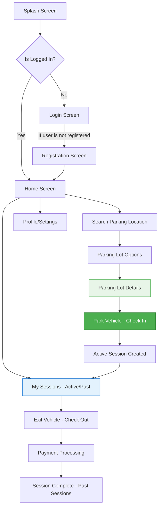
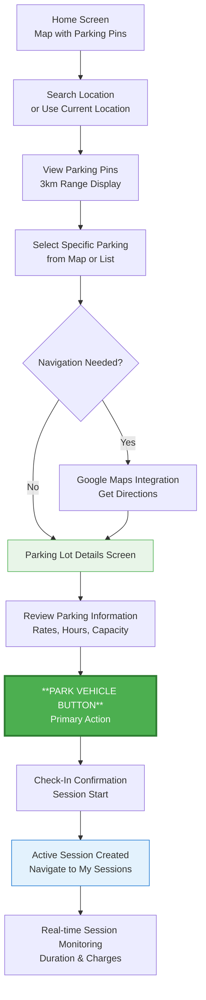
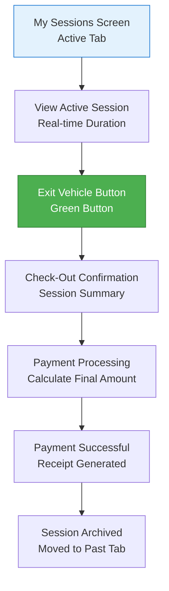
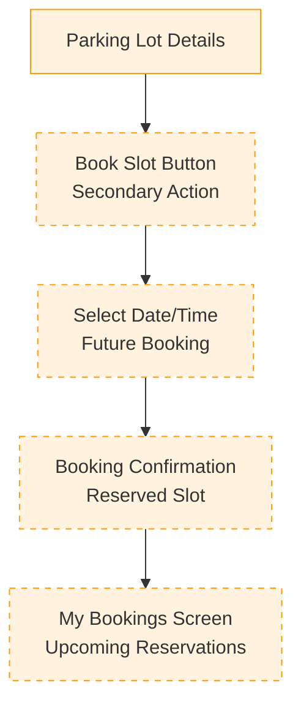
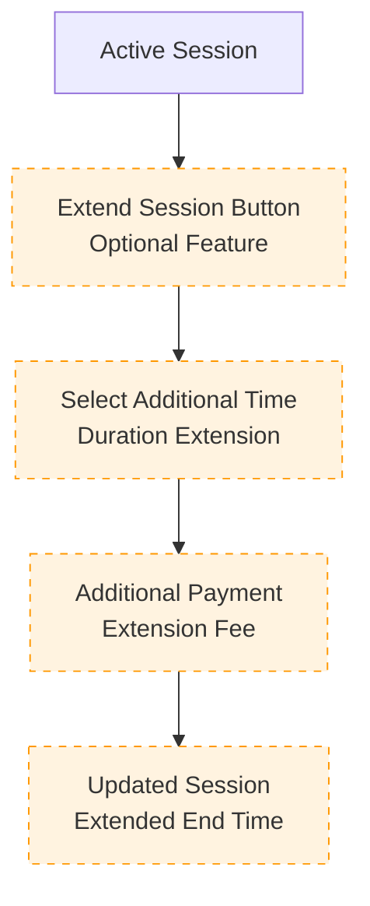

# Vision Parking App - Frontend UI PRD

## Overview

**Vision Parking App** is a native Android application (Java-based) that provides real-time parking availability through an intuitive search interface. The app enables users to find parking spots, check in/out of parking sessions, explore parking details, and manage their parking history. This app integrates with Google Maps APIs and supports both active parking sessions and booking functionality. This document outlines the **frontend design, UI flow**, and **API integration strategy** for Android Studio. The backend server (Flask + REST API) is already implemented and will be integrated after the UI is complete.

---

## 1. Objectives

- Design intuitive and responsive UI screens with focus on core parking management features.
- Create smooth user navigation through all functional modules.
- Implement real-time parking session management (active check-in/checkout).
- Integrate UI with existing Flask-based REST APIs (when available).
- Use placeholders/mock data for screens where APIs are pending or optional.

---

## 2. Core Features

Based on the application requirements, the following key features will be implemented:

### Primary Features

- **Login/Registration**: User authentication and account management
- **Searching**: Dialog-based search functionality on home screen for finding parking locations
- **Booking**: Reserve parking spots with date/time selection
- **Active Sessions**: Real-time management of current parking sessions with check-in/checkout
- **Past Sessions**: Historical view of completed parking sessions

### Secondary Features

- **Explore Parking Details**: Detailed information about parking locations including availability and pricing
- **Navigation**: Integration with maps for route guidance to parking locations

## 3. Target Platform

- **Platform**: Android
- **Language**: Java
- **IDE**: Android Studio
- **Minimum SDK**: 24+
- **UI Toolkit**: Android XML Layouts with Material Components

---

## 4. UI Screens and Flows

### 4.1 Splash Screen

**Target Design Reference**: Use the above image as the design template for the splash screen implementation.

**Functionality**:

- App logo with animation with Get Started button which redirects user to registration/login page.
- Navigates to Login or Home based on token existence

**Design Elements**:

- Follow the visual design shown in the reference image
- Implement the layout, colors, and styling as per the target design
- Ensure responsive design for different screen sizes

---

### 4.2 Authentication

#### Login Screen

**Target Design Reference**: Use the above image as the design template for the login screen implementation.

**Functionality**:

- Fields: Email, Password
- Buttons: Login, Register (redirects to Registration)
- Token saved locally on success (for auto-login)

**Design Elements**:

- Follow the visual design shown in the reference image
- Implement the layout, colors, and styling as per the target design
- Ensure responsive design for different screen sizes

#### Registration Screen

**Target Design Reference**: Use the above image as the design template for the registration screen implementation.

**Functionality**:

- Fields: Name, Email, Phone, Password, Address
- Button: Register
- On success: redirects to Login or Home

**Design Elements**:

- Follow the visual design shown in the reference image
- Implement the layout, colors, and styling as per the target design
- Ensure responsive design for different screen sizes

---

### 4.3 Home Screen

**Target Design Reference**: Use the above images as the design templates for the home screen implementation. Both variations show different approaches to the home screen layout.

**Functionality**:

- **Header Section**:

  - Hamburger menu icon (top-left) to open navigation sidebar
  - App title/logo in center

- **Search Section**:

  - Search Bar with location text input and search icon
  - Dialog-based search functionality for finding parking locations
  - "Use Current Location" button with location icon
  - Filter/settings icon for search preferences

- **Map View**:

  - Full-screen embedded Google Map View showing nearby parking lots
  - Interactive map with zoom controls
  - Parking location pins with color-coded availability status:
    - Green: Available spots
    - Yellow: Limited availability
    - Red: Full/No availability
  - Current user location marker
  - Distance indicators for parking locations

- **Navigation Sidebar** (accessible via hamburger menu):

  - User profile section with name and profile picture
  - Menu items:
    
    - Vehicles        
    - My Sessions
    - Bookings      **New Feature**      
    - Payments
    - My Permit
    - Favorites
    - Settings
    - Help & Support
    - Logout

- **Bottom Navigation Bar**:

  - Home (current screen)
  - My Sessions         **New Feature**
  - Bookings
  - Profile

- **Interactive Elements**:
  - Tap on parking pins to view quick info popup toast message of Parking Lot List screen
  - Swipe gestures for map navigation
  - Pull-to-refresh functionality for real-time updates

**Design Elements**:

- Follow the visual design shown in the reference images
- Implement the layout, colors, and styling as per the target design
- Choose the most appropriate design variation or combine elements from both
- Ensure responsive design for different screen sizes
- Maintain consistency with the overall app design language

---

### 4.4 Parking Lot Options

**Target Design Reference**: Use the above images as the design templates for the parking lot list screen implementation. Both variations show different approaches to displaying parking lot information.

**Functionality**:

#### Core Features:

- **Search Results Display**: Show list of parking lots based on search location or current location
- **Real-time Data**: Display live parking availability and pricing information
- **Interactive List Items**: Each parking lot entry is clickable for detailed view
- **Sorting & Filtering**: Options to sort by distance, price, or availability

**Note: Activity flow should be that Parking Lot Cards should be available only after clicking on specific parking lot on Parking Lot Options screen**  

#### Individual Parking Lot Card Elements:

- **Parking Lot Name**: Clear, prominent display of facility name
- **Address/Location**: Full address with street name and area
- **Distance Indicator**:
  - Show distance from current location (e.g., "0.5 km away")
  - Walking/driving time estimate
- **Availability Status**:
  - Color-coded availability badges:
    - Green: Available spots (>5 spots)
    - Yellow: Limited availability (1-5 spots)
    - Red: Full/No availability (0 spots)
  - Numerical display: "15/50 spots available"
- **Pricing Information**:
  - Hourly rate display (e.g., "₹20/hour")
  - Special rates if applicable (e.g., "₹100/day")
- **Rating & Reviews**:
  - Star rating display (1-5 stars)
  - Number of reviews (e.g., "4.2 ★ (128 reviews)")
- **Operating Hours**: Current status (Open/Closed) and hours
- **Quick Action Buttons**:
  - "Book Now" button for immediate reservation
  - "Navigate" button for directions
  - "Call" button for contact (if available)

#### Advanced Features:

- **Favorites**: Heart icon to save frequently used parking lots
- **Recent Searches**: Quick access to previously viewed lots
- **Filter Options**:
  - Price range slider
  - Distance radius
  - Availability status
  - Facility type (covered, open, multi-level)
  - Special features (EV charging, security, etc.)
- **Sort Options**:
  - Distance (nearest first)
  - Price (lowest first)
  - Availability (most available first)
  - Rating (highest first)
- **Map Toggle**: Switch between list view and map view
- **Refresh Functionality**: Pull-to-refresh for updated availability

#### User Interactions:

- **Tap on Card**: Navigate to Parking Lot Details screen
- **Swipe Actions**:
  - Swipe right: Add to favorites
  - Swipe left: Get directions
- **Long Press**: Show quick action menu
- **Search Bar**: Filter results by name or location
- **Location Services**: "Use Current Location" for nearby results

#### Loading & Error States:

- **Loading State**: Skeleton screens while fetching data
- **Empty State**: Message when no parking lots found
- **Error State**: Retry option when data fails to load
- **Offline Mode**: Show cached results with offline indicator

#### Accessibility Features:

- **Screen Reader Support**: Proper content descriptions
- **High Contrast Mode**: Enhanced visibility options
- **Large Text Support**: Scalable font sizes
- **Voice Navigation**: Voice commands for hands-free operation

**Design Elements**:

#### Visual Design Implementation:

- **Card-based Layout**: Each parking lot as a distinct card with rounded corners
- **Color Scheme**:
  - Primary colors matching app theme
  - Status colors: Green (#4CAF50), Yellow (#FFC107), Red (#F44336)
- **Typography**:
  - Parking lot name: Bold, 16sp
  - Address: Regular, 14sp, secondary color
  - Distance/Price: Medium, 12sp
- **Icons**:
  - Location pin for distance
  - Clock for operating hours
  - Star for ratings
  - Rupee symbol for pricing
- **Spacing**: Consistent 16dp margins and 8dp padding
- **Elevation**: Subtle shadow for card depth (2dp)

#### Responsive Design:

- **Phone Portrait**: Single column list
- **Phone Landscape**: Optimized horizontal layout
- **Tablet**: Two-column grid layout
- **Different Screen Densities**: Scalable assets and dimensions

#### Animation & Transitions:

- **Card Animations**: Subtle scale animation on tap
- **Loading Animations**: Smooth skeleton loading
- **Refresh Animation**: Pull-to-refresh indicator
- **Filter Transitions**: Smooth expand/collapse for filter options

#### Performance Optimization:

- **Lazy Loading**: Load parking lots as user scrolls
- **Image Caching**: Cache parking lot images for faster loading
- **Data Pagination**: Load results in batches of 20-30 items
- **Background Updates**: Refresh availability data every 30 seconds

---

### 4.5 Parking Lot Details (Explore Parking Details)

**Target Design Reference**: Use the above image as the design template for the parking lot details screen implementation.

**CRITICAL**: This screen must strictly follow the visual design shown in ParkingLotDetails.png. All layout, colors, spacing, and component positioning should match the target design exactly.

**Functionality**:

#### Screen Structure (Top to Bottom):

##### 1. Header Section:

- **Status Bar**: Standard Android status bar with time, battery, signal
- **Navigation Bar**:
  - Back arrow (←) on left side
  - Screen title "Parking Details" centered
  - Share icon on right side
- **Background**: White background for header

##### 2. Parking Lot Image Section:

- **Hero Image**: Large parking lot photo taking full width
- **Image Overlay Elements**:
  - Favorite heart icon (top-right corner of image)
  - Image indicators/dots if multiple images available
- **Image Height**: Approximately 1/3 of screen height

##### 3. Parking Lot Information Card:

- **Parking Lot Name**: Large, bold text (e.g., "Central Mall Parking")
- **Location Details**:
  - Full address with location pin icon
  - Distance from current location (e.g., "2.5 km away")
- **Operating Status**:
  - Current status indicator (Open/Closed)
  - Operating hours display

##### 4. Availability & Pricing Section:

- **Availability Display**:
  - Large numerical display of available spots (e.g., "45/100 Available")
  - Color-coded availability indicator
  - Real-time status badge
- **Pricing Information**:
  - Hourly rate prominently displayed
  - Additional pricing tiers if applicable
  - Special offers or discounts

##### 5. Amenities & Features Grid:

- **Icon Grid Layout**: 3-4 columns of amenity icons
- **Feature Icons**:
  - Security camera icon
  - Covered parking icon
  - EV charging icon
  - Wheelchair accessibility icon
  - 24/7 access icon
  - Payment methods accepted
- **Icon Style**: Consistent icon design with labels

##### 6. Reviews & Rating Section:

- **Overall Rating**: Star rating with numerical score
- **Rating Summary**: Brief statistics
- **Recent Reviews**: 2-3 most recent user reviews with:
  - User name/initial
  - Star rating
  - Review text (truncated)
  - Time stamp

##### 7. Location & Map Section:

- **Mini Map**: Embedded map showing parking location
- **Navigation Button**: "Get Directions" button
- **Nearby Landmarks**: List of nearby points of interest

##### 8. Action Buttons (Bottom):

- **Primary Action Button**:
  - "Park Now" button (full width, prominent)
  - Color: Primary app color (green)

#### Design Specifications:

##### Color Scheme:

- **Primary Colors**: Follow app's main color palette
- **Status Colors**:
  - Green (#4CAF50) for available/open
  - Yellow (#FFC107) for limited availability
  - Red (#F44336) for full/closed
- **Background**: White (#FFFFFF)
- **Text Colors**:
  - Primary text: Dark gray/black
  - Secondary text: Medium gray
  - Accent text: App primary color

##### Typography:

- **Parking Lot Name**: Bold, 24sp
- **Section Headers**: Medium, 18sp
- **Body Text**: Regular, 16sp
- **Caption Text**: Regular, 14sp
- **Button Text**: Medium, 16sp

##### Spacing & Layout:

- **Screen Margins**: 16dp left/right margins
- **Card Padding**: 16dp internal padding
- **Section Spacing**: 12dp between sections
- **Element Spacing**: 8dp between related elements

##### Interactive Elements:

- **Buttons**: Material Design elevated buttons with appropriate shadows
- **Cards**: Subtle elevation (2dp) with rounded corners (8dp radius)
- **Touch Targets**: Minimum 48dp touch target size
- **Ripple Effects**: Material Design ripple animations on touch

#### Implementation Requirements:

##### Data Integration:

- **Real-time Updates**: Availability data refreshes every 30 seconds
- **API Endpoints**: Connect to parking availability and details APIs
- **Caching**: Cache static information (images, amenities, reviews)
- **Error Handling**: Graceful handling of network failures

##### User Interactions:

- **Image Gallery**: Swipe through multiple parking lot images
- **Expandable Sections**: Tap to expand/collapse detailed information
- **Map Integration**: Tap map to open full-screen map view
- **Share Functionality**: Share parking lot details via system share sheet

##### Accessibility:

- **Screen Reader Support**: Proper content descriptions for all elements
- **High Contrast**: Support for high contrast mode
- **Large Text**: Support for system font scaling
- **Touch Accessibility**: Adequate touch target sizes

##### Performance:

- **Image Loading**: Progressive loading with placeholder images
- **Smooth Scrolling**: Optimized scroll performance
- **Memory Management**: Efficient image and data caching
- **Battery Optimization**: Minimize background updates when not visible

#### Technical Implementation Notes:

##### Android Components:

- **Activity/Fragment**: Use Fragment for better navigation integration
- **RecyclerView**: For amenities grid and reviews list
- **ViewPager2**: For image gallery if multiple images
- **MapFragment**: For embedded map display
- **Material Components**: Use Material Design components throughout

##### Layout Structure:

- **ScrollView**: Main container for scrollable content
- **ConstraintLayout**: For complex positioning and responsive design
- **CardView**: For information cards with elevation
- **LinearLayout**: For simple vertical/horizontal arrangements

This implementation should result in a pixel-perfect match to the target design while providing all the functional requirements for a comprehensive parking lot details screen.

---

### 4.6 My Sessions (Active & Past)

**Target Design Reference**: Use the provided images as the design templates for the My Sessions screen implementation showing both "Active" and "Past" tabs with session cards.

**CRITICAL**: This screen must strictly follow the visual design shown in the target images. All layout, colors, spacing, and component positioning should match the target design exactly.

**Functionality**:

#### Screen Structure (Based on Target Design):

##### 1. Header Section:

- **Navigation Bar**:
  - Back arrow (←) on left side
  - Screen title "My Sessions" centered (bold, dark text)
  - Clean white background

##### 2. Tab Navigation:

- **Tab Bar**:
  - Two tabs: "Active" and "Past"
  - Active tab has green underline indicator
  - Inactive tab appears in gray
  - Clean, minimal tab design
  - Full-width tab bar below header

##### 3. Active Tab Content:

###### Active Session Card:

- **Location Information**:

  - **Parking Lot Name**: "Stuttgart, Stephangarage" (bold, dark text)
  - **Address**: "kronenstraße" (gray, smaller text)
  - **Chevron Icon**: Right arrow (>) indicating expandable/clickable

- **Session Details**:

  - **Session ID**: "ID: #11235532232" (gray text)
  - **Current Duration**: Clock icon + "47 mins, 2010 - 16.00 hrs" (with dot indicator)
  - **Total Duration**: "47 mins Total" (larger text)

- **Action Button**:
  - **"Exit Vehicle" Button**:
    - Green background (#4CAF50)
    - White text
    - Rounded corners
    - Right-aligned
    - Medium size button

##### 4. Past Tab Content:

###### Past Session Cards (Multiple):

- **Card Structure** (repeated for each past session):

  - **Location Information**:

    - **Parking Lot Name**: "Stuttgart, Am Schlossplatz" (bold, dark text)
    - **Address**: "Stauffenbergstrasse" (gray, smaller text)
    - **Chevron Icon**: Right arrow (>) for details
    - **Menu Icon**: Three dots (⋮) on right for options

  - **Session Details**:
    - **Session ID**: "ID: #11235532232" (gray text)
    - **Date/Time Entries**:
      - Bullet points (•) with dates and times
      - "13th Feb, 2018 - 16.00 hrs"
      - "13th Feb, 2018 - 18.40 hrs"
    - **Duration**: Clock icon + total duration (e.g., "2 hrs 40 mins")
    - **Payment Info**:
      - "Total: €5" (left side)
      - "Payment Successful" with checkmark icon (right side, green)

##### 5. Card Layout & Spacing:

- **Card Design**:

  - White background cards
  - Subtle shadow/elevation (2dp)
  - Rounded corners (8dp)
  - 16dp margin between cards
  - 16dp internal padding

- **Divider Lines**:
  - Thin gray lines separating cards
  - Full-width horizontal dividers

#### Design Specifications:

##### Color Scheme:

- **Background**: Light gray/white (#F5F5F5)
- **Card Background**: Pure white (#FFFFFF)
- **Primary Text**: Dark gray/black (#212121)
- **Secondary Text**: Medium gray (#757575)
- **Active Tab Indicator**: Green (#4CAF50)
- **Exit Vehicle Button**: Green background (#4CAF50)
- **Success Indicator**: Green (#4CAF50)

##### Typography:

- **Screen Title**: Bold, 20sp, dark
- **Tab Labels**: Medium, 16sp
- **Location Names**: Bold, 16sp, dark
- **Addresses**: Regular, 14sp, gray
- **Session Details**: Regular, 14sp, gray
- **Duration**: Regular, 14sp, dark
- **Button Text**: Medium, 14sp, white
- **Payment Status**: Regular, 14sp, green

##### Layout & Spacing:

- **Screen Margins**: 16dp left/right
- **Card Margins**: 16dp between cards
- **Card Padding**: 16dp internal padding
- **Tab Height**: 48dp
- **Element Spacing**: 8dp between related elements
- **Section Spacing**: 12dp between different sections

##### Icons:

- **Navigation**: Back arrow (24dp)
- **Expandable**: Chevron right (20dp)
- **Menu**: Three dots vertical (20dp)
- **Time**: Clock icon (16dp)
- **Success**: Checkmark in circle (16dp)
- **Bullet Points**: Small filled circles (8dp)

#### Implementation Requirements:

##### Core Features:

- **Tab Navigation**:
  - ViewPager2 with TabLayout
  - Smooth tab switching
  - Active tab indicator animation
- **Real-time Updates**:
  - Live duration counter for active sessions
  - Auto-refresh session data
- **Session Management**:
  - Exit vehicle functionality
  - Session details expansion
  - Payment status tracking

##### Data Integration:

- **Active Sessions API**:
  - Fetch current active sessions
  - Real-time duration updates
  - Session status monitoring
- **Past Sessions API**:
  - Fetch historical sessions
  - Pagination for large lists
  - Session details and receipts
- **Payment Integration**:
  - Payment status verification
  - Transaction history

##### User Interactions:

- **Tab Switching**: Smooth transition between Active/Past
- **Card Expansion**: Tap to view session details
- **Exit Vehicle**: Process checkout flow
- **Menu Actions**: Options for past sessions (receipt, support, etc.)
- **Pull-to-Refresh**: Update session data

##### Technical Implementation:

- **Fragment Structure**:
  - Main Fragment with ViewPager2
  - ActiveSessionsFragment
  - PastSessionsFragment
- **RecyclerView**: For session lists with proper adapters
- **Timer Service**: Background service for active session duration
- **Local Caching**: Store session data for offline viewing

#### User Flow:

1. **Access My Sessions**: Navigate from bottom navigation or home
2. **View Active Tab**: See current active sessions (default tab)
3. **Monitor Active Session**: Real-time duration and status updates
4. **Exit Vehicle**: Tap button to initiate checkout process
5. **Switch to Past Tab**: View historical parking sessions
6. **View Past Details**: Tap on past sessions for detailed information
7. **Access Receipts**: View payment confirmations and receipts

This implementation creates a comprehensive tabbed My Sessions screen that clearly separates active and past sessions, matching the target designs exactly while providing intuitive navigation and complete session management functionality.

---

### 4.7 Booking Screen

- Select:
  - Date and Time (start and end)
  - Duration auto-calculated
- Show:
  - Estimated cost
  - Booking summary
- Button: "Confirm Booking"
- On success: navigate to Booking Confirmation

---

### 4.8 Booking Confirmation

- Display:
  - Booking ID
  - Date, time, slot info
  - QR code (optional)
- Button: "Go to My Bookings"

---

### 4.9 My Bookings

- Tabs: Upcoming, Past
- List of reservations:
  - Date/time, location, status
- Click: View details / Cancel if applicable

---

### 4.10 Track & Navigate

- Open Google Maps with destination prefilled
- Show:
  - ETA
  - Current route from user location to lot

---

### 4.11 Payment Screen

- Fields:
  - Card/UPI input or redirect to payment provider
  - Payment method selection
- Confirmation on success/failure

---

### 4.12 Rate & Review Screen

- Rate using stars (1 to 5)
- Optional: text review, upload image
- Show average rating

---

### 4.13 Profile / Settings

- Display:
  - User Info
  - Saved payment methods (if supported)
- Actions:
  - Edit profile
  - Logout

---

## 5. Activity Flow/Navigation Flow

### 5.1 Primary Application Flow (Core Features)

**PRIMARY FOCUS**: The main user journey centers around the "Park Vehicle" check-in flow through the Parking Lot Details screen.

### 5.2 PRIMARY USE CASE: Park Vehicle Check-In Flow

**Core User Journey**: Home Screen → Search Location → Select Parking → Parking Details → **Park Vehicle**

### 5.3 SECONDARY USE CASE: Exit Vehicle Check-Out Flow

**Flow**: My Sessions → Active Tab → Exit Vehicle → Payment → Complete

### 5.4 FUTURE SCOPE FEATURES (Secondary Priority)

#### 5.4.1 Booking Feature (Future Implementation)

#### 5.4.2 Session Extension Feature (Future Implementation)

### 5.5 Detailed Navigation Steps (Primary Flow)

#### CORE: Park Vehicle Check-In Process

1. **Home Screen (Map View)**
   - Display current location with nearby parking pins
   - Color-coded availability indicators (Green/Yellow/Red)
   - Search functionality for specific locations

2. **Location Search & Selection**
   - Search bar for address/location input
   - "Use Current Location" button
   - 3km radius parking display
   - Interactive map with parking pins

3. **Parking Selection**
   - Tap on parking pin or select from list
   - View basic info popup
   - Navigate to detailed view

4. **Optional Navigation**
   - Google Maps integration for directions
   - ETA and route information
   - Return to app after reaching location

5. **Parking Lot Details Screen** ⭐ **KEY SCREEN**
   - Complete parking information display
   - Real-time availability and pricing
   - Operating hours and amenities
   - **"Park Vehicle" button - PRIMARY ACTION**

6. **Park Vehicle Check-In**
   - Tap "Park Vehicle" button
   - Confirmation dialog with session details
   - Session creation and timer start
   - Automatic navigation to My Sessions

7. **Active Session Management**
   - Real-time duration tracking
   - Live charge calculation
   - Session status monitoring
   - Access via My Sessions → Active tab

#### CORE: Exit Vehicle Check-Out Process

1. **Access My Sessions**
   - Navigate from bottom navigation or home
   - Default to Active tab

2. **View Active Session**
   - Real-time session information
   - Current duration and charges
   - Location details

3. **Exit Vehicle Process**
   - Tap "Exit Vehicle" button
   - Review session summary
   - Confirm final charges

4. **Payment & Completion**
   - Process payment transaction
   - Generate digital receipt
   - Archive session to Past tab

### 5.6 Implementation Priority

#### Phase 1 (MVP - Core Features)
1. ✅ **Park Vehicle Check-In Flow** (Primary)
2. ✅ **Exit Vehicle Check-Out Flow** (Primary)
3. ✅ **My Sessions Management** (Active/Past tabs)
4. ✅ **Parking Lot Details Screen** (Key decision point)
5. ✅ **Home Screen with Map Integration**

#### Phase 2 (Future Enhancements)
1. 🔄 **Booking System** (Advanced reservations)
2. 🔄 **Session Extension** (Duration extension)
3. 🔄 **Advanced Payment Options**
4. 🔄 **Push Notifications**
5. 🔄 **Loyalty Programs**

